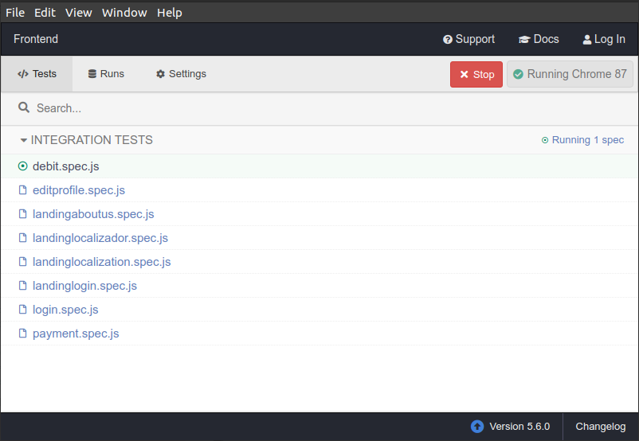
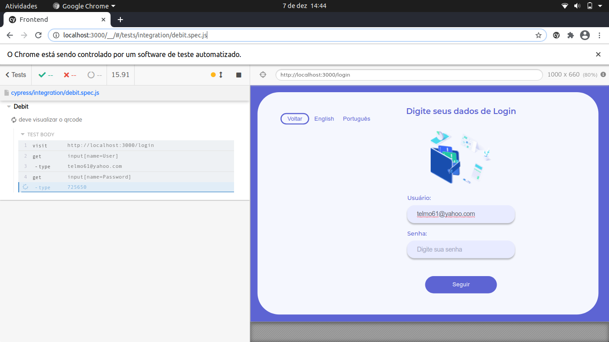

<h1 align="center">
  FRONTEND
</h1>

<p align="justify">
  Repositório da aplicação frontend com a finalidade de apoiar e organizar o desenvolvimento das funcionalidade do sistema da</p>

[Vamos-Parcelar-Lift-Learning](https://vamosparcelar.com.br/blog/vamos-parcelar-e-escolhida-para-o-lift-learning/).

  <p>Este repositório contempla as seguintes funcinalidades:</p>

- Pesquisar contas por código localizador;
- Realizar log in;
- Selecionar débitos/contas a serem pagas;
- Visualizar detalhe indivisual de cada conta;
- Preencher cartão com a chave [PIX](https://www.bcb.gov.br/estabilidadefinanceira/perguntaserespostaspix) para realizar pagamento;
- Realizar pagamentos a vista por meio de pagamentos instantâneos [PIX](https://www.bcb.gov.br/estabilidadefinanceira/pix), através da geração de um QR code dinâmico;
- Visualizar os comprovantes de pagamento;
- Imprimir comprovante de pagamento de uma conta;
- Receber e visualizar valor de [cashback](https://vamosparcelar.zendesk.com/hc/pt-br/articles/360052061894-17-O-que-%C3%A9-cashback-e-para-que-ele-serve-);
- Editar dados do perfil;

## Status do Projeto:

**Em desenvolvimento**

## Acesso ao Deploy do Projeto

<p align="justify">
É possivel acessar a versão mais estavel da aplicação de forma rápida, simples e fácil. Basta acessar a demo da aplicação no Heroku clicando na imagem a baixo.
  <p align="center">
    <a href="https://pix-lift-learning-vp.herokuapp.com/" target="_blank">
    </a>
  </p>
</p>

## Pré requisitos para rodar a aplicação e os comandos para instalação

<p align="justify">Para clonar e utilizar está aplicação, você irá precisar de:

- [Git](https://git-scm.com)
- [Node.js v10.16][nodejs] ou maior (Recomendamos a versão estável - LTS) + [Yarn v1.13][yarn] ou maior instalada em sua máquina.</p>

<p align="justify">Digite no seu terminal:</p>

```bash
# Clone o repositório
$ git clone https://github.com/Vamos-Parcelar-Lift-Learning/Frontend

# Navegue até o repositório
$ cd Frontend

# Instale as dependencias
$ yarn install

```

[nodejs]: https://nodejs.org/
[yarn]: https://yarnpkg.com/

## Como rodar a aplicação (Passo a Passo)

Para rodar a aplicação basta digitar no seu terminal:

```bash
# Rode a aplicação
$ yarn start
```

e acessar o endereço http://localhost:3000/

## Como rodar os testes

Caso seja necessário executar teste na aplicação, é necessário executar o [Cypress](https://docs.cypress.io/guides/getting-started/installing-cypress.html#Opening-Cypress)

```bash
# Abra os testes da aplicação
$ yarn tests
```

Escolha um caso de teste para executar:

  <p align="center">
    
  </p>

Ao clicar no teste ele será executado automaticamente

  <p align="center">
    
  </p>

## Licença do Repositório

...
